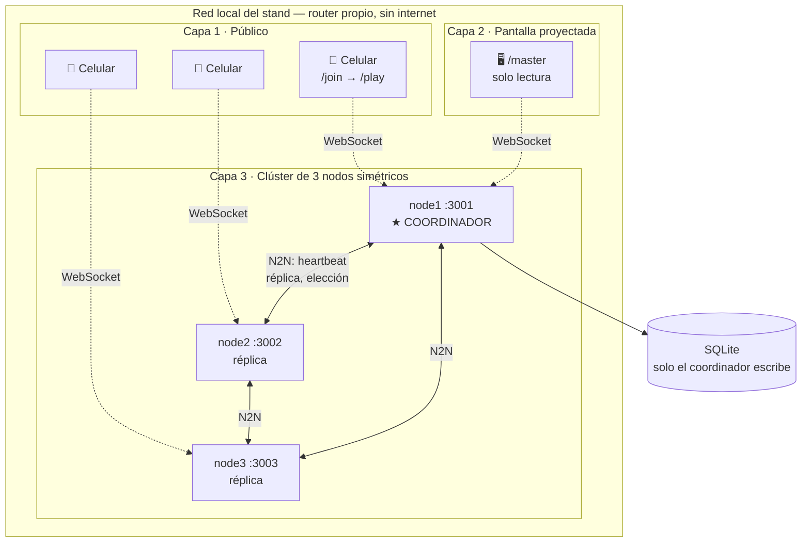
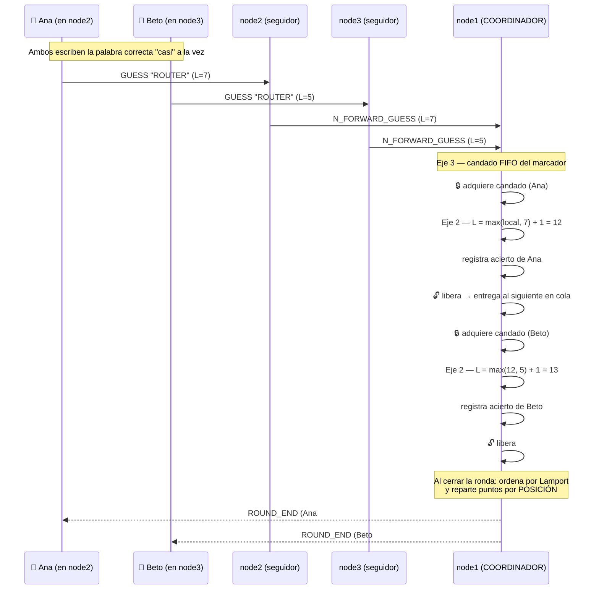
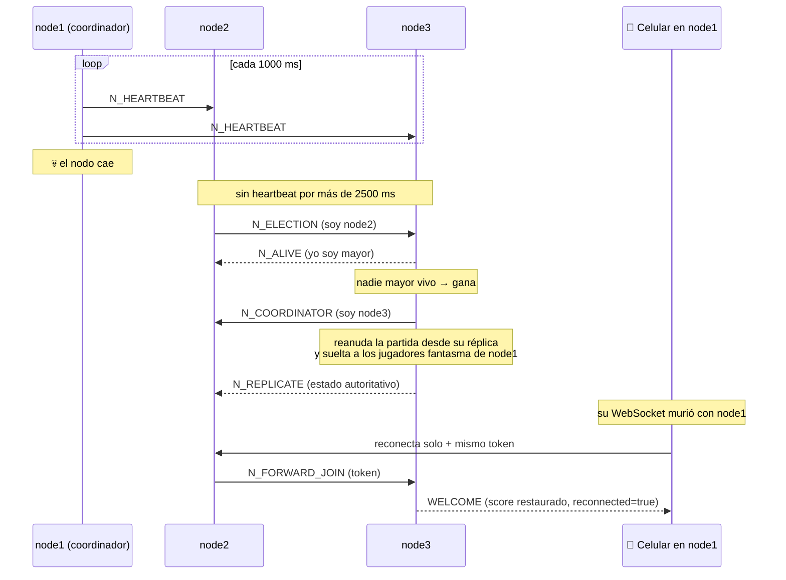
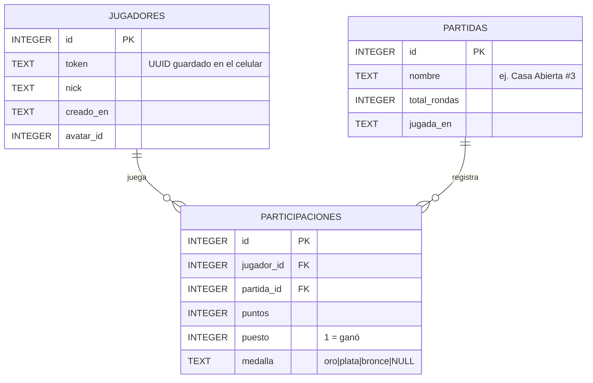

# Silunet

**Juego de adivinanza de siluetas en tiempo real, sobre un clúster distribuido de 3 nodos.**

Proyecto integrador de **Sistemas Distribuidos** y **Gestión para la Verificación y
Validación de Software** — PUCE Sede Manabí, Ingeniería de Software.

Diseñado para la feria "Casa Abierta": el público escanea un QR con su celular, se une
sin instalar nada, y una pantalla proyectada muestra el estado de la partida en vivo.

> La consigna original de la materia se conserva en [`CONSIGNA.md`](CONSIGNA.md).
> Este README documenta **el sistema tal como está construido**.

---

## Tabla de contenidos

1. [Funcionamiento general](#1-funcionamiento-general)
2. [Arquitectura técnica](#2-arquitectura-técnica)
3. [Diagramas](#3-diagramas)
4. [Base de datos](#4-base-de-datos)
5. [Metodología de desarrollo](#5-metodología-de-desarrollo)
6. [Guía detallada de despliegue](#6-guía-detallada-de-despliegue)
7. [Verificación y Validación](#7-verificación-y-validación)
8. [Estructura del repositorio](#8-estructura-del-repositorio)

---

## 1. Funcionamiento general

### Ciclo de una partida

1. El operador pulsa **"Iniciar partida"** en la pantalla proyectada (`/master`).
2. Se abre una **votación de 8 segundos**: cada celular elige una **temática**
   (Computadores, Redes, Animales, Comida…) y una **dificultad** (Fácil / Intermedio /
   Difícil). Gana lo más votado; los empates y la ausencia de votos se resuelven al azar,
   de modo que la partida nunca se traba esperando.
3. **Cuenta regresiva "3, 2, 1, ¡YA!"** emitida por el servidor, sincronizada para todos.
4. Aparece la silueta + la palabra oculta con guiones (`_ E _ A _ T E`). Cada **4 s** sin
   acierto se revela una letra adicional. La ronda dura **24 s**.
5. A los **5 s** se desbloquea una **pista** opcional: usarla reduce la recompensa de esa
   ronda al **80 %**.
6. Al cerrar todas las rondas: ranking con medallas (oro/plata/bronce) y actualización del
   **salón de la fama** histórico.

### Puntaje: por posición lógica, no por tiempo

Es el detalle que ancla el juego a la teoría de la materia. El puntaje **no** depende de
los milisegundos que tardaste ni de la latencia de tu Wi-Fi, sino de tu **posición en el
orden lógico de Lamport** resuelto por el coordinador:

```
puntos = 100 + 900 × (1 − (posición − 1) / N)
```

con `N` = total de aciertos de la ronda. El primero en orden lógico obtiene 1000; el
último tiende a 100. Así un celular con mala señal no queda castigado por la red, solo
por el orden causal real de los eventos.

### Banco de palabras

**8 temáticas × 20 palabras = 160**, en `src/wordBank.ts`:

`Computadores` · `Redes` · `Dispositivos` · `Almacenamiento` · `Animales` · `Comida` ·
`Transporte` · `Instrumentos`

La **dificultad se deriva del largo** de la palabra (no se anota a mano, así no puede
desincronizarse): ≤5 letras = fácil, 6-8 = intermedio, 9+ = difícil. Cada temática tiene
~6 fáciles, ~8 intermedias y ~6 difíciles, para que cualquier combinación votada tenga
suficientes rondas disponibles.

Las siluetas son SVG dibujados con formas geométricas simples y `fill="currentColor"`
(sin imágenes externas ni CDN). Para ilustrar una palabra nueva basta agregar su constante
SVG y sumarla al mapa `ART`.

### Otras funcionalidades

| Función | Descripción |
|---|---|
| **Reconexión automática** | Si el nodo de un celular (o de la pantalla proyectada) cae, rota solo al siguiente nodo vivo conservando el puntaje de la partida en curso. |
| **Panel didáctico** | En `/master`: reloj de Lamport en vivo, cola del candado y estado de la elección Bully, para que los ejes se **vean** funcionando durante la defensa. |
| **Salón de la fama** | Ranking histórico acumulado de todas las partidas jugadas. |
| **Identidad persistente** | Token guardado en el celular: reconoce al jugador que vuelve sin pedirle registro. |
| **Sonidos** | Sintetizados con Web Audio API — sin archivos ni CDN, porque la LAN de la feria no tiene internet. |
| **Avatares** | Elegibles en `/join`, visibles en todos los rankings. |

---

## 2. Arquitectura técnica

### Stack

- **Backend:** Node.js + TypeScript con la librería **`ws`** (WebSocket puro, sin
  abstracciones que oculten el protocolo). Un único código de servidor que se ejecuta
  **tres veces** con variables de entorno distintas para formar el clúster.
- **Frontend:** HTML + CSS + JavaScript plano, **sin proceso de build**, para que abra
  directo desde el QR sin instalar nada.
- **Persistencia:** `node:sqlite` (SQLite integrado en Node 22+). Sin servidor de base de
  datos externo.

### Decisión de diseño clave: sin Redis, sin BD externa para el estado vivo

El estado de la partida vive **en memoria** y el coordinador lo replica a los seguidores.
Esto es deliberado: externalizar el estado a Redis o a una base de datos compartida
**recentralizaría** el sistema y vaciaría de sentido la elección de líder — el punto único
de fallo volvería por la puerta de atrás. La réplica entre nodos *es* el mecanismo que
elimina el SPOF, porque cualquier seguidor tiene lo necesario para asumir la coordinación.

### Los 4 ejes: dónde vive cada uno

| Eje | Mecanismo | Implementación |
|---|---|---|
| **1 · Comunicación bidireccional y concurrencia** | WebSockets puros, cero polling. Difusión a clientes y entre nodos. | `src/server.ts`, `src/cluster.ts` |
| **2 · Sincronización y ordenamiento lógico** | Relojes de Lamport (`tick` / `update` / `merge`) ordenan los aciertos entre nodos. | `src/lamport.ts` |
| **3 · Exclusión mutua y consistencia** | Candado lógico con cola FIFO que serializa el acceso al marcador compartido. | `src/mutex.ts` |
| **4 · Tolerancia a fallos y reconfiguración** | Heartbeats + elección de líder (algoritmo del Matón / Bully) + réplica pasiva de estado. | `src/cluster.ts` |

### Protocolo de mensajes

Todo el protocolo está tipado en `src/types.ts`, separado en tres familias:

- **`S2C`** — servidor → cliente (`ROUND_START`, `TICK`, `CORRECT_ANSWER`, `VOTE_TALLY`,
  `CLUSTER_STATE`, `ENGINE_STATE`…)
- **`C2S`** — cliente → servidor (`JOIN`, `GUESS`, `CAST_VOTE`, `PING`…)
- **`N2N`** — nodo ↔ nodo (`N_HEARTBEAT`, `N_REPLICATE`, `N_ELECTION`, `N_ALIVE`,
  `N_COORDINATOR`, `N_FORWARD_*`…)

Un jugador conectado a un **seguidor** no nota diferencia: el seguidor reenvía su acción
al coordinador (`N_FORWARD_GUESS`) y la respuesta vuelve enrutada a su conexión exacta
(`N_SEND_TO`).

### Roles del clúster

Los tres nodos son **simétricos** (mismo código). En operación normal uno es
**coordinador** —única fuente de verdad, el único que muta el marcador y el único que
escribe en la base de datos— y los otros dos mantienen una **réplica pasiva** en memoria,
lista para asumir el mando si el líder cae.

---

## 3. Diagramas

### Arquitectura de despliegue en el stand



### Dos aciertos concurrentes: Lamport + exclusión mutua



### Caída del coordinador: algoritmo del Matón (Bully)



### Modelo de datos



> Los diagramas renderizados en PNG para el reporte impreso están en
> [`docs/diagrams/`](docs/diagrams/), junto al reporte arquitectónico en HTML.

---

## 4. Base de datos

El esquema completo y comentado está en **[`BDD.sql`](BDD.sql)**.

- **Motor:** SQLite vía `node:sqlite`. **No hay que instalar ni levantar nada**: el
  archivo se crea solo en `data/silunet-<NODE_ID>.db` al arrancar cada nodo.
- **`BDD.sql` es documentación de referencia**, no un paso obligatorio del despliegue: la
  aplicación aplica el mismo esquema sola en `src/db.ts` (`migrate()`, idempotente).
  Para recrear la base a mano: `sqlite3 data/silunet-node1.db < BDD.sql`.
- **Alcance:** solo guarda **historia ya cerrada** (identidades y resultados de partidas
  terminadas). El estado vivo nunca toca la base.
- **Regla distribuida:** solo el **coordinador electo** escribe. Cada nodo tiene su propio
  archivo, listo para cuando Bully lo promueva.
- Las estadísticas (partidas ganadas, puntos totales, medallero) **se calculan** con
  consultas agregadas, no se almacenan — así no pueden quedar desincronizadas.

---

## 5. Metodología de desarrollo

> **⚠️ Sección a completar por el equipo.** No la redacté por ustedes porque describe el
> proceso real del grupo (herramienta de gestión, ceremonias, reparto de tareas) y no es
> algo que se pueda inferir del código sin inventarlo. Abajo queda la plantilla con lo
> que la rúbrica pide y lo que sí es verificable desde el repositorio.

**Metodología elegida:** _(ej. Scrum / Kanban / XP)_ — justificar en 2-3 líneas por qué se
eligió para un proyecto de este tamaño y duración.

**Herramienta de gestión:** _(Jira / Trello / GitHub Projects)_ — enlace al tablero.

**Organización del trabajo:**

| Aspecto | Detalle |
|---|---|
| Duración de iteración | _(ej. sprints de 1 semana)_ |
| Ceremonias | _(daily, revisión, retro…)_ |
| Definición de "terminado" | _(ej. compila + bots de V&V en verde + revisado por otro integrante)_ |
| Reparto de responsabilidades | _(quién llevó cada eje / frontend / V&V)_ |

**Trazabilidad en el repositorio** (esto sí es verificable y conviene mencionarlo):

- Los commits que implementan un eje lo declaran explícitamente en el mensaje
  (`"Eje 3: exclusion mutua explicita (candado FIFO)"`), de modo que el historial de git
  sirve como evidencia directa frente a la rúbrica.
- El desarrollo fue **incremental y verificable**: primero el juego jugable en un solo
  nodo, y solo después la partición en 3 nodos y cada eje por separado.
  `git log --oneline` muestra esa progresión.

---

## 6. Guía detallada de despliegue

### 6.1. Requisitos previos

| Requisito | Detalle |
|---|---|
| **Node.js 22 o superior** | **Obligatorio.** La persistencia usa `node:sqlite`, que no existe en versiones anteriores. Verificar con `node --version`. |
| Git | Solo para clonar el repositorio. |
| Navegador moderno | En los celulares y en la laptop del proyector. |

No hace falta instalar bases de datos, Redis ni servidores web.

### 6.2. Instalación

```bash
git clone <URL-del-repositorio>
cd silunet
npm install      # descarga ws + TypeScript (una sola vez)
npm run build    # compila TypeScript a dist/
```

### 6.3. Modo A — Un solo nodo (prueba rápida del juego)

```bash
npm run dev      # compila y arranca en un paso
```

Al arrancar imprime en consola la IP y las URLs. Abrir:

- **Pantalla proyectada:** http://localhost:3001/master → pulsar "Iniciar partida"
- **Jugador:** http://localhost:3001/join → abrir 2-3 pestañas con nicks distintos para
  ver la concurrencia.

### 6.4. Modo B — Clúster de 3 nodos en UNA laptop (desarrollo y defensa)

Es **el mismo código** ejecutado tres veces con variables de entorno distintas. Abrir
**tres terminales** en la carpeta del proyecto:

**PowerShell (Windows):**

```powershell
# Terminal 1 — coordinador inicial
$env:NODE_ID="node1"; $env:PORT="3001"; $env:COORDINATOR_ID="node1"; $env:PEERS="ws://localhost:3002,ws://localhost:3003"; node dist/server.js

# Terminal 2
$env:NODE_ID="node2"; $env:PORT="3002"; $env:COORDINATOR_ID="node1"; $env:PEERS="ws://localhost:3001,ws://localhost:3003"; node dist/server.js

# Terminal 3
$env:NODE_ID="node3"; $env:PORT="3003"; $env:COORDINATOR_ID="node1"; $env:PEERS="ws://localhost:3001,ws://localhost:3002"; node dist/server.js
```

**Bash (Linux / macOS):**

```bash
NODE_ID=node1 PORT=3001 COORDINATOR_ID=node1 PEERS=ws://localhost:3002,ws://localhost:3003 node dist/server.js
NODE_ID=node2 PORT=3002 COORDINATOR_ID=node1 PEERS=ws://localhost:3001,ws://localhost:3003 node dist/server.js
NODE_ID=node3 PORT=3003 COORDINATOR_ID=node1 PEERS=ws://localhost:3001,ws://localhost:3002 node dist/server.js
```

Cuando los tres estén arriba, cada consola muestra `✓ Peer listo: nodeX`. Los jugadores
pueden entrar por **cualquiera** de los tres puertos y compiten sobre el mismo marcador.

### 6.5. Modo C — Despliegue real en la feria (3 laptops + router propio)

**Red.** Llevar un **router/AP propio**, no usar la red del recinto (suele tener
*AP isolation* o puertos bloqueados, lo que rompe el juego). No necesita salida a
internet: todo el sistema funciona en LAN cerrada.

Lista de verificación de red:

- [ ] **Desactivar "AP / Client Isolation"** en el router. Es la falla más común: los
      celulares se conectan al Wi-Fi pero no pueden hablarle a las laptops.
- [ ] **Reservar IP fija (DHCP reservation)** para las 3 laptops, para que el QR no cambie
      si el router reinicia.
- [ ] **Permitir el puerto de cada nodo** en el firewall de cada laptop (conexiones
      entrantes desde la LAN).
- [ ] **Banda:** 5 GHz aguanta mejor la concurrencia; 2.4 GHz tiene más alcance pero se
      satura con muchos celulares.
- [ ] **Capacidad:** un router doméstico sostiene ~30-50 dispositivos de forma confiable.
      Para más público, usar un AP de gama media o dos APs en la misma subred.

**Arranque.** Averiguar la IP de cada laptop en esa red (`ipconfig` en Windows) **antes**
de arrancar, y usar esas IPs reales en `PEERS` — no `localhost`:

```powershell
# Laptop 1 (192.168.50.10) — coordinador inicial
$env:NODE_ID="node1"; $env:PORT="3001"; $env:COORDINATOR_ID="node1"; $env:PEERS="ws://192.168.50.11:3002,ws://192.168.50.12:3003"; node dist/server.js

# Laptop 2 (192.168.50.11)
$env:NODE_ID="node2"; $env:PORT="3002"; $env:COORDINATOR_ID="node1"; $env:PEERS="ws://192.168.50.10:3001,ws://192.168.50.12:3003"; node dist/server.js

# Laptop 3 (192.168.50.12)
$env:NODE_ID="node3"; $env:PORT="3003"; $env:COORDINATOR_ID="node1"; $env:PEERS="ws://192.168.50.10:3001,ws://192.168.50.11:3002"; node dist/server.js
```

Si una laptop tiene Wi-Fi **y** Ethernet activos a la vez, confirmar que `PEERS` y la URL
del QR apuntan a la IP del router propio y no a la otra red.

**Ensayo obligatorio.** Montar el router + los 3 nodos + tantos celulares reales como se
consiga, **uno o dos días antes**, y confirmar que todos ven la partida sin caídas.

### 6.6. Verificar el despliegue

```bash
curl http://localhost:3001/api/info
```

Devuelve JSON con el nodo, quién es el coordinador, los peers conectados y la fase actual
del juego — sirve para confirmar que el clúster se formó bien antes de que llegue público.

### 6.7. Probar la tolerancia a fallos (demo de la defensa)

Con la partida en curso, `Ctrl+C` en la terminal del **coordinador**. Lo esperado:

1. Los otros dos detectan la caída por ausencia de heartbeats (~2,5 s).
2. Ejecutan el algoritmo del Matón y eligen un nuevo coordinador.
3. El nuevo líder reanuda la partida desde su réplica: **el público no ve congelamiento**.
4. El panel de `/master` refleja el cambio en vivo, y los celulares del nodo caído se
   reconectan solos a otro nodo **conservando su puntaje**.

### 6.8. Variables de entorno

| Variable | Para qué sirve | Default |
|---|---|---|
| `NODE_ID` | Identificador único del nodo en el clúster. | `node1` |
| `PORT` | Puerto HTTP/WebSocket donde escucha. | `3001` |
| `COORDINATOR_ID` | Quién es coordinador al arrancar. | `node1` |
| `PEERS` | URLs WS de los otros nodos, separadas por comas. | *(vacío = nodo solo)* |

### 6.9. Problemas comunes

| Síntoma | Causa / solución |
|---|---|
| `'node' no se reconoce` | Node no instalado o fuera del PATH. Reinstalar y reabrir la terminal. |
| `Error: listen EADDRINUSE :::3001` | El puerto está ocupado por otra instancia. Cerrarla o usar otro `PORT`. |
| Cambié TypeScript y no veo el cambio | Falta `npm run build` (o usar `npm run dev`). |
| Los celulares no abren la página | Deben estar en la **misma Wi-Fi** y usar la IP local (`http://192.168.x.x:3001/join`), no `localhost`. |
| Los nodos no se ven entre sí | Revisar que `PEERS` apunte a los puertos/IPs correctos y que cada nodo tenga `NODE_ID` y `PORT` distintos. |
| `node:sqlite` no existe | Node menor a 22. Actualizar. |

Guía paso a paso ampliada: [`EJECUCION.md`](EJECUCION.md).

---

## 7. Verificación y Validación

Dos bots que levantan un **clúster real de 3 nodos** (el mismo `dist/server.js` de
producción) y se conectan como clientes WebSocket reales — **no son mocks**.

```bash
npm run build            # requerido antes de correr los bots

npm run vv:concurrencia  # ~30 s
npm run vv:caos          # ~3 min
```

**`vv:concurrencia`** (Ejes 2 y 3) — 7 bots repartidos en los 3 nodos aciertan "a la vez"
y verifica que:

- ninguno se pierde en el candado del Eje 3;
- el ranking final queda ordenado **estrictamente** por timestamp de Lamport;
- la posición anunciada en vivo coincide con la posición final;
- el puntaje corresponde a la fórmula por posición lógica, no al tiempo de red;
- no hay jugadores duplicados.

**`vv:caos`** (Eje 4) — mata al coordinador **dos veces seguidas** (hasta dejar un solo
nodo vivo) con la partida en curso, y verifica que:

- cada caída dispara una elección Bully hacia un coordinador **distinto**, en tiempo
  acotado;
- la partida **nunca se congela** (vuelve a haber `TICK`/`ROUND_START` poco después);
- los celulares caídos con su nodo reconectan **sin duplicarse** en el marcador final.

Con `VV_VERBOSE=1` delante del comando se ven los logs internos de cada nodo. Ambos bots
salen con **código 0** si pasan, así que sirven tal cual en un pipeline de CI.

**Herramientas complementarias contempladas para la materia de V&V:** SonarQube
(calidad), Jenkins (CI/CD), Cypress o Selenium (e2e) y Burp Suite (seguridad).

---

## 8. Estructura del repositorio

```
src/
  server.ts     HTTP + WebSocket, enrutado de mensajes, punto de entrada
  game.ts       reglas del juego: rondas, votación, puntaje, pistas
  cluster.ts    comunicación entre nodos, heartbeats, elección Bully (Eje 4)
  lamport.ts    reloj lógico de Lamport (Eje 2)
  mutex.ts      candado FIFO del marcador compartido (Eje 3)
  db.ts         persistencia con node:sqlite
  wordBank.ts   banco de palabras + siluetas SVG + dificultad
  types.ts      protocolo completo (S2C / C2S / N2N) y modelos de datos
public/         cliente sin build: join.html, play.html, master.html, sounds.js
vv/             bots de verificación y validación
scripts/        arranque de cada nodo (PowerShell)
docs/           reporte arquitectónico y diagramas en PNG
BDD.sql         esquema de base de datos documentado
EJECUCION.md    guía de ejecución paso a paso
CONSIGNA.md     consigna original de la materia
```

### Sitemap

| Ruta | Qué es |
|---|---|
| `/join` | Lo que abre el QR: nick + avatar, asigna el celular a un nodo. |
| `/play` | Cliente del celular: silueta, palabra, timer, intento, pista, ranking. |
| `/master` | Pantalla proyectada (solo lectura): silueta grande, ranking con medallas, panel didáctico y salud del clúster. |
| `/api/info` | JSON con el estado del nodo (depuración y scripts). |
