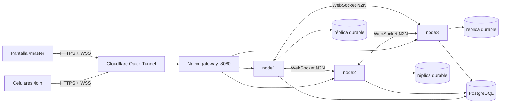

# Silunet

Juego multijugador de adivinanzas en tiempo real construido como un sistema distribuido: tres backends replican el estado, mantienen quorum 2/3 y eligen un coordinador nuevo si el actual desaparece.

El público no instala nada. Abre un enlace o escanea el QR, entra desde el celular y juega mientras `/master` muestra la partida y el estado del clúster.

## Dónde está cada guía

| Si quieres... | Lee |
| --- | --- |
| Levantar todo en una laptop y compartir un enlace público | Este README, [Inicio rápido](#inicio-rápido-docker--túnel) |
| Ejecutar un nodo en cada una de tres laptops | [README-TRES-LAPTOPS.md](README-TRES-LAPTOPS.md) |
| Entender los conceptos distribuidos para la defensa | [docs/conceptos/README.md](docs/conceptos/README.md) |
| Ver el despliegue Docker con más variantes | [docs/DESPLIEGUE-DOCKER.md](docs/DESPLIEGUE-DOCKER.md) |
| Revisar las pruebas | [test/README.md](test/README.md) y [Verificación](#verificación) |

---

## Inicio rápido: Docker + túnel

Esta es la forma recomendada para una exposición o prueba con celulares. Una laptop ejecuta seis contenedores:

- `node1`, `node2` y `node3`: backends del clúster;
- `gateway`: Nginx, una sola puerta de entrada;
- `postgres`: identidad e historial;
- `tunnel`: Cloudflare Quick Tunnel, activado con el perfil correspondiente.

Los celulares pueden estar en otra Wi-Fi o usar datos móviles. Solo necesitan navegador e internet.

### Requisitos

- Windows 10/11 con PowerShell;
- Docker Desktop abierto;
- conexión a internet en la laptop anfitriona;
- puertos locales `3001`, `3002`, `3003` y `8080` disponibles.

No necesitas instalar Node.js para esta modalidad. Tampoco necesitas abrir puertos entrantes en el router ni configurar *port forwarding*: el túnel crea una conexión saliente hacia Cloudflare.

### 1. Clonar y entrar

```powershell
git clone https://github.com/acampanaa/silunet.git
cd silunet
```

Si ya tienes el proyecto, solo abre PowerShell en su carpeta.

### 2. Levantar el clúster y el túnel

```powershell
.\scripts\docker-cluster.ps1 tunnel
```

La primera ejecución tarda más porque descarga imágenes y compila Silunet. Cuando termine, busca una línea parecida a:

```text
https://palabras-aleatorias.trycloudflare.com
```

Si la URL no alcanzó a aparecer en la salida inicial:

```powershell
docker compose -f compose.cluster.yaml --profile tunnel logs -f --no-color tunnel |
  Select-String -Pattern 'https://[a-z0-9-]+\.trycloudflare\.com'
```

Espera entre 5 y 30 segundos. Presiona `Ctrl+C` después de copiar la URL; eso solo deja de seguir los logs, no apaga el sistema.

### 3. Abrir las pantallas

Si Cloudflare entregó, por ejemplo:

```text
https://palabras-aleatorias.trycloudflare.com
```

abre:

| Uso | Dirección |
| --- | --- |
| Pantalla proyectada | `https://palabras-aleatorias.trycloudflare.com/master` |
| Jugadores | `https://palabras-aleatorias.trycloudflare.com/join` |
| Diagnóstico JSON | `https://palabras-aleatorias.trycloudflare.com/api/info` |

Abre `/master` primero. El QR de esa pantalla se construye con el mismo origen público y envía a `/join`; no hay que editarlo manualmente.

> La URL identifica al gateway, no a un nodo concreto. Cuando cae un backend, el navegador vuelve a conectarse a esa misma URL y Nginx lo dirige a otro nodo sano.

### 4. Comprobar que está sano

```powershell
.\scripts\docker-cluster.ps1 status

Invoke-RestMethod http://localhost:8080/api/info |
  Select-Object nodeId,coordinator,connectedPeers,quorumAvailable,replicaIndex,phase
```

Antes de empezar deben cumplirse estas condiciones:

- los tres nodos aparecen `healthy`;
- `quorumAvailable` es `True`;
- `connectedPeers` contiene dos nodos;
- existe un `coordinator`;
- el túnel sigue `Up`.

### 5. Apagar al terminar

```powershell
.\scripts\docker-cluster.ps1 down
```

Los volúmenes de PostgreSQL y las réplicas se conservan. No uses `docker compose down -v` salvo que quieras borrar deliberadamente esos datos.

---

## Prueba de fuego

La prueba correcta mata al coordinador durante una partida y observa que los otros dos nodos conservan quorum, eligen reemplazo y continúan enviando eventos a los navegadores.

### Preparación

1. Levanta el sistema con `tunnel`.
2. Abre `/master` y une al menos dos celulares desde `/join`.
3. Inicia una partida en modo Clásico.
4. Espera a que aparezca una silueta y el reloj esté corriendo.
5. Confirma que los tres nodos estén `healthy`.

### Provocar la caída

En otra ventana de PowerShell:

```powershell
.\scripts\docker-cluster.ps1 fire
```

El script consulta `/api/info`, identifica el coordinador vigente y usa una terminación inmediata. No utiliza `stop`, porque `stop` espera un cierre gradual y no representa una falla abrupta.

Debes observar:

- un aviso breve de reconexión en `/master` o en algunos celulares;
- la URL pública no cambia;
- aparece otro coordinador;
- el reloj o la siguiente ronda vuelve a avanzar;
- las respuestas siguen llegando;
- el nodo derribado queda fuera y los otros dos mantienen quorum 2/3.

Para ver el resultado desde consola:

```powershell
Invoke-RestMethod http://localhost:8080/api/info |
  Select-Object coordinator,quorumAvailable,replicaIndex,phase
```

### Reintegrar la réplica

```powershell
.\scripts\docker-cluster.ps1 recover
```

Espera a que los tres nodos vuelvan a `healthy` antes de repetir la prueba.

> No ejecutes `fire` dos veces seguidas. Un clúster de tres nodos tolera una falla; si derribas dos, queda una sola réplica y el sistema se suspende deliberadamente para evitar *split-brain*.

---

## Misma Wi-Fi, sin túnel

Si todos los dispositivos están en la misma red local:

```powershell
.\scripts\docker-cluster.ps1 up
```

En la laptop anfitriona:

```text
http://localhost:8080/master
http://localhost:8080/join
```

En celulares, sustituye `localhost` por la IPv4 de la laptop:

```text
http://192.168.1.20:8080/join
```

En esta modalidad sí debes permitir TCP `8080` en el firewall privado de Windows. No hace falta publicar `3001`, `3002` ni `3003` para los celulares, porque entran por el gateway.

---

## Qué demuestra cada topología

| Topología | Qué distribuye | Qué falla en la prueba | Límite |
| --- | --- | --- | --- |
| Una laptop + Docker + túnel | Tres procesos, réplicas, coordinación y almacenamiento | Un contenedor coordinador | Si muere la laptop, mueren los tres nodos y el túnel |
| Tres laptops físicas | Procesos, réplicas y hosts físicos | Un contenedor, una laptop o un enlace LAN | Requiere configurar IP, firewall y red local |

Para una presentación sencilla, Docker+túnel es suficiente para mostrar comunicación, réplica, quorum y elección. Para demostrar tolerancia a la pérdida de una máquina física, usa [README-TRES-LAPTOPS.md](README-TRES-LAPTOPS.md).

---

## Arquitectura



Cloudflare no coordina el juego y no conoce el clúster. Solo transporta tráfico público hasta Nginx. Nginx tampoco decide el estado: balancea conexiones. La autoridad pertenece al coordinador elegido entre los tres backends.

### Los cuatro ejes distribuidos

| Eje | Implementación | Evidencia visible |
| --- | --- | --- |
| Comunicación | WebSocket cliente-backend y backend-backend | Juego y panel actualizados en tiempo real |
| Orden lógico | Reloj de Lamport | Orden causal de acciones y puntajes |
| Exclusión mutua | Candado FIFO del marcador | Aciertos concurrentes procesados sin pisarse |
| Tolerancia a fallos | Heartbeats, quorum 2/3, réplicas durables y elección Bully | `fire` cambia de coordinador y la partida continúa |

### Consistencia y persistencia

El coordinador procesa una acción, persiste un snapshot local y lo replica. La acción se confirma cuando existe respaldo durable de una mayoría. Si el coordinador cae, los supervivientes comparan sus réplicas, aumentan el término de liderazgo y reanudan desde la versión confirmada más reciente.

PostgreSQL guarda identidades, avatares e historial de partidas. No reemplaza la réplica viva del juego ni participa en la elección.

---

## El juego

1. El operador inicia desde `/master`.
2. Los celulares votan categoría y dificultad.
3. Todos reciben la cuenta regresiva y la misma silueta.
4. Las respuestas se envían por WebSocket y se ordenan con Lamport.
5. El marcador se actualiza bajo exclusión mutua.
6. Al final se muestra el ranking y se persiste el resultado.

Incluye modo Clásico, Relajo y SiluStack, banco de palabras por categorías, pistas, avatares, sonidos sintetizados e identidad persistente por token.

---

## Comandos cotidianos

| Acción | Comando |
| --- | --- |
| Levantar clúster local | `.\scripts\docker-cluster.ps1 up` |
| Levantar clúster y túnel | `.\scripts\docker-cluster.ps1 tunnel` |
| Ver servicios | `.\scripts\docker-cluster.ps1 status` |
| Ver logs | `.\scripts\docker-cluster.ps1 logs` |
| Reiniciar backends y gateway | `.\scripts\docker-cluster.ps1 restart` |
| Matar coordinador actual | `.\scripts\docker-cluster.ps1 fire` |
| Reintegrar los tres nodos | `.\scripts\docker-cluster.ps1 recover` |
| Apagar todo | `.\scripts\docker-cluster.ps1 down` |

Reiniciar o apagar el contenedor `tunnel` genera una URL pública nueva. Reiniciar únicamente un nodo no cambia la URL.

---

## Verificación

Para desarrollar o ejecutar pruebas necesitas Node.js 22 y las dependencias:

```powershell
npm ci
npm run build
npm run test:unit
```

Prueba de concurrencia y orden lógico:

```powershell
npm run vv:concurrencia
```

Prueba automatizada de caos con tres procesos, dos jugadores reconectables y dos cambios de coordinador:

```powershell
npm run test:fire
```

Pruebas Selenium/JUnit:

```powershell
npm run test:junit
npm run test:selenium
```

Consulta [test/README.md](test/README.md) para requisitos adicionales de navegador y Java.

---

## Si algo falla

### No aparece la URL `trycloudflare.com`

```powershell
docker compose -f compose.cluster.yaml --profile tunnel logs --tail 100 tunnel
```

Busca errores de DNS, salida TCP/443 o acceso a Cloudflare. Un Quick Tunnel puede tardar varios segundos.

### El QR muestra una URL anterior

La URL cambia cuando se recrea o reinicia `tunnel`. Abre `/master` desde la URL nueva y fuerza una recarga con `Ctrl+F5`. No escribas la URL dentro del código.

### Se queda “buscando un nodo”

```powershell
.\scripts\docker-cluster.ps1 status
Invoke-RestMethod http://localhost:8080/api/info |
  Select-Object coordinator,connectedPeers,quorumAvailable,phase
```

Si ya hiciste una caída, ejecuta `recover`. No derribes un segundo nodo mientras el primero siga fuera.

### No se envían votos o palabras

Entra siempre por `/join`, no reutilices una pestaña antigua de `/play`, y recarga la página. Comprueba que el WebSocket público responde y que `quorumAvailable` sea `True`.

### No se escuchan sonidos

Los navegadores móviles bloquean audio automático hasta que el usuario toca la pantalla. Pulsa un botón del juego, revisa el volumen multimedia y desactiva el modo silencioso.

### El puerto ya está ocupado

```powershell
Get-NetTCPConnection -State Listen |
  Where-Object LocalPort -in 3001,3002,3003,8080
```

Cierra el proceso conflictivo o cambia los puertos publicados en `compose.cluster.yaml`.

### Quiero empezar desde cero

`down` conserva datos. Borrar volúmenes elimina historial y réplicas y no es reversible; hazlo únicamente si entiendes ese efecto.

---

## Estructura del repositorio

```text
src/                         backend, juego y algoritmos distribuidos
public/                      /join, /play, /master y recursos estáticos
docker/nginx.conf            gateway y balanceo WebSocket
compose.cluster.yaml         tres nodos + PostgreSQL + gateway + túnel
compose.node.yaml            un nodo para despliegue físico
scripts/docker-cluster.ps1   operación de la topología en una laptop
scripts/docker-node.ps1      operación de un nodo por laptop
scripts/configure-docker-node.ps1
test/                        pruebas unitarias y Selenium
vv/                          concurrencia, latencia y caos
docs/conceptos/              explicación progresiva para la defensa
BDD.sql                      esquema PostgreSQL
```

## Límites y anotaciones

- El Quick Tunnel es temporal, no ofrece garantía de disponibilidad y cambia de URL al reiniciarse.
- El túnel es una entrada pública única; no convierte los celulares en nodos del backend.
- Los navegadores son clientes. El coordinador siempre es uno de los procesos `node1`, `node2` o `node3`.
- El clúster de tres nodos tolera una sola falla simultánea.
- La contraseña PostgreSQL predeterminada es solo para desarrollo o demostraciones controladas.
- Para una instalación permanente conviene usar un túnel nombrado, dominio propio, secretos externos y TLS para PostgreSQL.

## Licencia y contexto académico

Proyecto integrador de Sistemas Distribuidos y Gestión para la Verificación y Validación de Software, PUCE Sede Manabí, Ingeniería de Software.