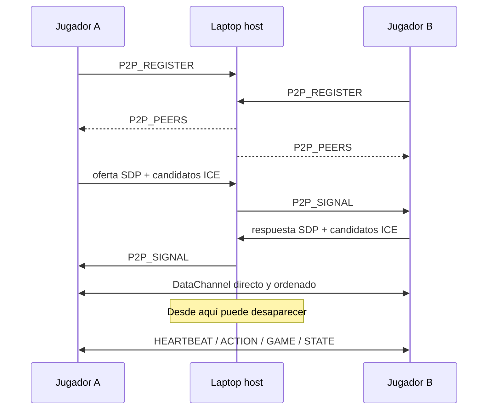

# 02 · Red y transportes: HTTP, WebSocket y WebRTC

Silunet usa tres mecanismos de comunicación porque resuelven problemas diferentes. La prueba de
fuego funciona al mover el camino crítico desde una conexión cliente-servidor hacia conexiones
directas entre navegadores.

## 1. HTTP: cargar y consultar

HTTP sigue el patrón petición-respuesta:

```text
navegador  -- GET /play -->  laptop
navegador  <-- HTML/JS ----  laptop
```

Se usa para:

- descargar `/play`, `/master`, JavaScript, fuentes e imágenes;
- consultar endpoints como `/api/info` o avatares;
- precargar siluetas y revelaciones antes de la caída.

Si el host desaparece, ya no hay servidor HTTP. Por eso ninguna ronda futura puede depender de
descargar una imagen en ese momento.

## 2. WebSocket: canal vivo con el servidor

WebSocket mantiene una conexión bidireccional. Mientras Node está disponible, jugadores y
`/master` reciben `ROUND_START`, `TICK`, `RANKING` y snapshots sin abrir una petición HTTP por
cada evento.

También transporta la **señalización WebRTC**:

- `P2P_REGISTER`: una pestaña anuncia su `peerId` y rol;
- `P2P_PEERS`: el servidor entrega la lista de peers;
- `P2P_SIGNAL`: reenvía ofertas, respuestas y candidatos ICE;
- `P2P_SNAPSHOT`: distribuye la réplica más reciente.

WebSocket es bidireccional, pero sigue siendo centralizado: si la laptop muere, todas esas
conexiones terminan.

## 3. WebRTC DataChannel: canal directo entre navegadores

Una vez señalizados, los navegadores abren `RTCDataChannel` entre sí. Los mensajes ya no pasan
por Node:



La señalización no transporta la partida P2P; solamente ayuda a los navegadores a encontrarse y
negociar la conexión. Es parecido a presentar a dos personas: quien las presenta puede irse una
vez que ya hablan directamente.

## Plano de control y plano de datos

Esta separación ayuda a explicar la arquitectura:

- **Plano de control:** registro, roster, señalización, snapshots iniciales. Depende de Node.
- **Plano de datos tras el failover:** heartbeats, acciones, eventos y estados. Viaja por
  DataChannel y no depende de Node.

Antes de la caída, el juego normal todavía usa WebSocket como plano de datos autoritativo. El
DataChannel se mantiene preparado como ruta de respaldo.

## Malla completa

Cada jugador abre un canal con todos los demás. Con `N` jugadores existen:

```text
conexiones = N × (N − 1) / 2
```

| Jugadores | Conexiones entre jugadores |
|---:|---:|
| 2 | 1 |
| 3 | 3 |
| 4 | 6 |
| 5 | 10 |

El servidor limita la sala a cinco jugadores para que esta malla sea predecible y manejable en
celulares. La validación está en `MAX_PLAYERS` dentro de [`src/server.ts`](../../src/server.ts).

## Por qué funciona en LAN y puede fallar en otra red

[`public/p2p.js`](../../public/p2p.js) crea `RTCPeerConnection` con `iceServers: []`. No usa STUN
ni TURN externos: está diseñado para candidatos locales dentro de la misma LAN.

Esto evita depender de internet, pero impone condiciones:

- todos deben estar en el mismo router/AP;
- el router no debe activar **AP isolation**, **client isolation** o red de invitados aislada;
- el firewall debe permitir el tráfico local negociado por WebRTC;
- la laptop no debe ser el punto de acceso cuya desaparición apaga toda la red.

El despliegue correcto usa un router/AP independiente. Si los celulares dependen del hotspot de
la misma laptop que se apaga, también desaparece el medio de comunicación y ningún algoritmo
P2P puede compensarlo.

## Qué significa “sin HTTP” en la prueba

No significa que el sistema nunca usó HTTP. Significa que, después de preparar la partida y
matar Node, las acciones comprobadas por la prueba (`GUESS`, ticks, cierre y siguiente ronda)
viajan y se resuelven sin nuevas llamadas HTTP ni WebSocket central.

## Código relacionado

- Formación del peer y DataChannel: `ensurePeer`, `handleSignal` y `bindDataChannel` en
  [`public/p2p.js`](../../public/p2p.js).
- Roster y relé de señalización: `P2P_REGISTER` y `P2P_SIGNAL` en
  [`src/server.ts`](../../src/server.ts).
- Integración con la interfaz: [`public/play.html`](../../public/play.html).

Anterior: [01 · Panorama](01-panorama-y-vocabulario.md). Siguiente:
[03 · Estado autoritativo y snapshots](03-estado-autoritativo-y-snapshots.md).
