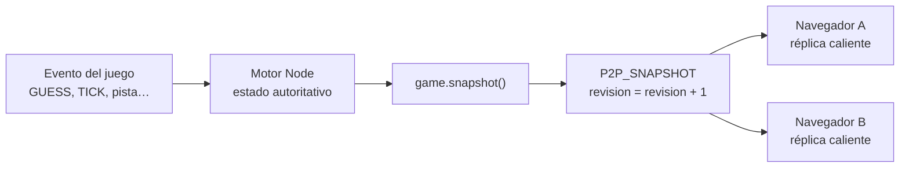

# 03 · Estado autoritativo y snapshots

Una partida puede entenderse como una **máquina de estados**: existe un estado actual y cada
evento válido produce el siguiente. Si un nuevo líder conoce suficientemente bien el estado
actual, puede continuar aplicando las mismas reglas.

## Estado vivo frente a historia

Silunet separa dos tipos de información:

| Tipo | Ejemplos | Dónde vive | ¿Es necesaria durante el failover? |
|---|---|---|---|
| **Estado vivo** | fase, ronda, reloj, palabra, aciertos, jugadores, puntajes | Memoria de Node y réplicas en navegadores | Sí |
| **Historia cerrada** | perfiles, partidas terminadas, medallas, salón de la fama | PostgreSQL o SQLite | No |

Consultar PostgreSQL no reconstruiría una ronda en curso porque la base deliberadamente no
recibe cada tick. Además, si la laptop que aloja la base está caída, tampoco sería alcanzable.

## Qué es un snapshot

Un snapshot es una fotografía serializable del estado vivo en un momento concreto. La interfaz
`GameSnapshot` está en [`src/types.ts`](../../src/types.ts) y `Game.snapshot()` la construye en
[`src/game.ts`](../../src/game.ts).

Incluye, entre otros:

| Campo | Por qué hace falta |
|---|---|
| `phase` | Saber si se está votando, jugando, cerrando ronda o terminando. |
| `rounds` | Tener la cola completa de palabras para iniciar rondas futuras sin host. |
| `currentRoundIndex` | Saber cuál ronda está activa. |
| `round` | Palabra, máscara, orden de revelación, tiempo y aciertos actuales. |
| `players` | Identidad de partida, nick, puntaje y estado de conexión. |
| `lamport` | Continuar el orden lógico sin reiniciar el reloj. |
| `votes` y `difficultyVotes` | Reconstruir una votación en curso. |
| `mode` | Decidir si el motor P2P sabe continuar ese modo. |
| `recentWords` | Reducir repeticiones entre partidas. |
| `sharedClock`, `cleared`, `stack` | Estado de Relajo/SiluStack, aunque el failover web actual solo activa Clásico. |

La copia se envía como JSON. En el navegador se clona para que cada peer tenga su propio objeto
y no comparta referencias JavaScript con otro proceso.

## Snapshot completo frente a eventos

Un evento dice “qué acaba de ocurrir”:

```text
TICK { timeLeft: 14 }
```

Un snapshot dice “cómo está todo ahora”:

```text
fase=playing, ronda=2, tiempo=14, jugadores=[...], aciertos=[...], lamport=37, ...
```

Los eventos son pequeños y buenos para actualizar la interfaz. Los snapshots son más pesados,
pero permiten que una réplica que perdió un evento vuelva a tener una imagen completa.

## Flujo de replicación antes de la caída



[`src/server.ts`](../../src/server.ts) difunde un nuevo `P2P_SNAPSHOT` después de broadcasts
globales y cambios privados relevantes. También entrega el snapshot actual cuando un peer se
registra.

## Revisiones y rechazo de copias viejas

Cada snapshot del servidor lleva una revisión creciente. Un navegador lo acepta únicamente si
no está en failover y la revisión no es anterior a la última observada. Esto evita que un mensaje
retrasado retroceda el juego.

Después de la caída, el líder usa `stateVersion`. Los seguidores aceptan `STATE` solamente si:

1. el failover está activo;
2. el emisor es el `leaderId` elegido;
3. la versión es mayor que la que ya poseen.

No es un log de consenso como Raft: es replicación de la última fotografía desde una autoridad
única. Para una demo pequeña reduce complejidad, a cambio de no ofrecer recuperación durable ni
reconciliación avanzada después de particiones largas.

## El punto de corte inevitable

Puede existir una ventana muy pequeña entre un cambio en Node y la llegada del snapshot a todos
los peers. Si el host muere exactamente allí, algún navegador puede tener una revisión anterior.
La elección hace que un solo líder continúe, pero no garantiza que siempre sea el peer con la
copia más nueva: la regla actual elige por `peerId`, no por `stateVersion`.

Para la prueba de fuego controlada esto es suficiente porque se espera que la malla esté lista y
los snapshots converjan antes de desconectar el host.

## Por qué el snapshot contiene la respuesta

El líder P2P debe validar `GUESS` y construir rondas futuras sin consultar Node. Por eso la cola
de `WordEntry` incluye las palabras. Un usuario que inspeccione la memoria JavaScript podría ver
la respuesta. Es una concesión explícita de seguridad por disponibilidad en una demostración
académica; no sería apropiada para un juego competitivo con adversarios.

## Qué no es un snapshot

- No es una copia de PostgreSQL.
- No se escribe en el almacenamiento del celular.
- No sobrevive por sí solo a recargar la pestaña.
- No garantiza consenso frente a participantes maliciosos.
- No reemplaza la caché de archivos de imagen; estado y recursos son problemas separados.

Anterior: [02 · Red y transportes](02-red-y-transportes.md). Siguiente:
[04 · Malla P2P y réplicas](04-malla-p2p-y-replicas.md).
