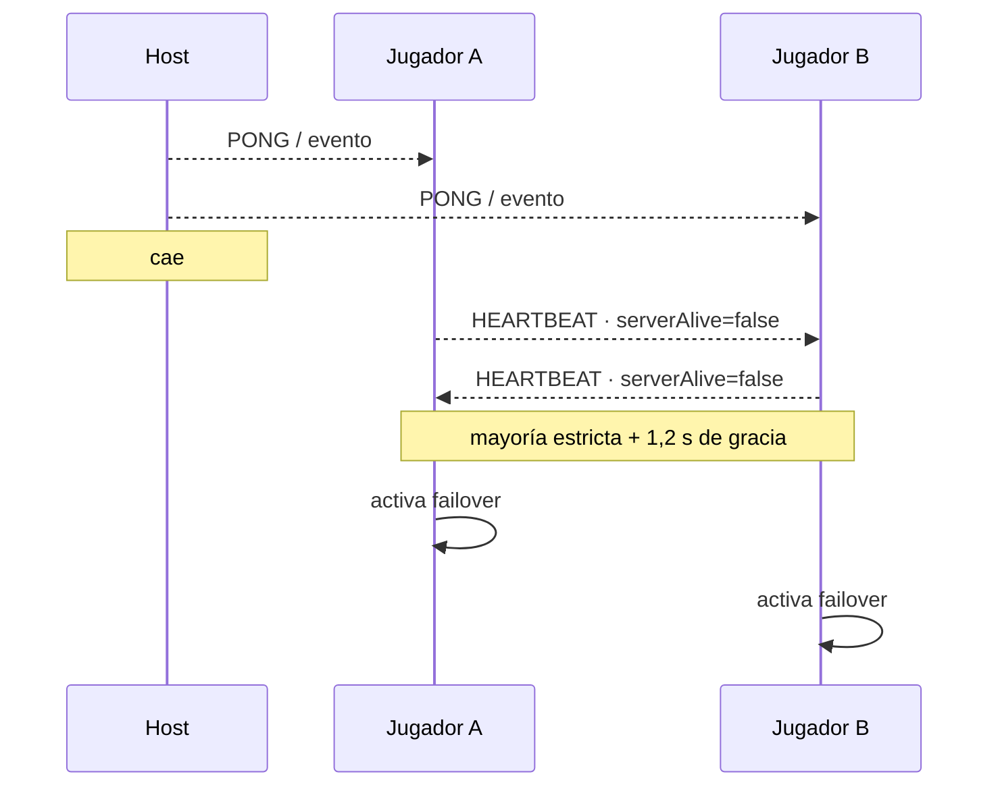

# 05 · Detección de fallos: heartbeats, timeout y mayoría

En una red distribuida no llega un mensaje perfecto que diga “el servidor murió”. Un nodo solo
puede observar que dejó de recibir señales. Por eso se habla de **detector de fallos** y de
“sospechar” una caída.

## Señales de vida del host

Mientras Node responde, el navegador actualiza `lastServerSeen`. Cualquier mensaje auténtico del
servidor demuestra vida; además, el cliente envía `PING` cada segundo y recibe `PONG` incluso en
fases donde el juego no genera ticks.

Hay dos caminos para detectar la pérdida:

1. El evento `WebSocket.onclose` llama inmediatamente `serverClosed()`.
2. Si el socket no se cierra limpiamente, pasan más de `3200 ms` sin mensajes y `monitor()` marca
   el servidor como no disponible.

El segundo camino es importante ante desconexiones abruptas, cable retirado o Wi-Fi perdido.

## Heartbeats entre peers

Cada navegador difunde por DataChannel un `HEARTBEAT` cada `1000 ms`. Incluye:

- `peerId`, rol, `playerId` y nick;
- si ese peer todavía observa vivo al servidor;
- `leaderId` y `stateVersion` actuales.

El receptor guarda cuándo vio por última vez a cada peer y su opinión sobre el host.

## Constantes actuales

| Constante | Valor | Significado |
|---|---:|---|
| `HEARTBEAT_MS` | 1000 ms | Frecuencia de heartbeat P2P. |
| `SERVER_HEARTBEAT_TIMEOUT_MS` | 3200 ms | Silencio del host necesario para sospecharlo. |
| `SERVER_DOWN_GRACE_MS` | 1200 ms | Espera adicional antes de activar failover. |
| `PEER_TIMEOUT_MS` | 3500 ms | Silencio para considerar muerto un peer. |
| intervalo de `monitor()` | 500 ms | Frecuencia de evaluación local. |

Por el muestreo del monitor y la red, el failover no ocurre en un milisegundo exacto. En una caída
sin `onclose`, el orden de magnitud esperado es:

```text
3,2 s para sospechar + 1,2 s de gracia + hasta 0,5 s de muestreo
```

Si `onclose` se dispara enseguida, se evita la primera espera, pero se mantiene la gracia y la
exigencia de mayoría.

## Por qué no activar failover ante la primera sospecha

Un solo navegador puede tener mala señal mientras Node sigue atendiendo a los demás. Si ese peer
se proclamara líder de inmediato existirían dos autoridades:

- Node seguiría procesando acciones de algunos jugadores;
- el navegador aislado procesaría otras acciones por P2P.

Eso es un escenario de **split-brain**. Silunet lo mitiga exigiendo que una mayoría estricta de
los jugadores conectados por DataChannel reporte `serverAlive=false`.

## Cálculo de mayoría

`hasServerDownMajority()` reúne las opiniones de:

- el propio peer, si su rol es `player`;
- cada peer conocido cuyo rol es `player` y cuyo DataChannel está abierto.

Se activa únicamente cuando:

```text
reportes de caída > total de reportes / 2
```

Ejemplos:

| Jugadores visibles | Reportes de caída requeridos |
|---:|---:|
| 2 | 2 |
| 3 | 2 |
| 4 | 3 |
| 5 | 3 |

`/master` no vota. Un observador no debe decidir que el sistema de jugadores cambie de autoridad.

## El problema teórico: fallo frente a lentitud

En un sistema asíncrono no se puede distinguir con certeza un nodo muerto de uno extremadamente
lento usando solo timeouts. El proyecto elige umbrales prácticos para una LAN controlada.

Esto implica dos tipos de error posibles:

- **falso positivo:** el host estaba lento y fue declarado caído;
- **detección tardía:** el host murió, pero se espera el timeout para actuar.

La gracia y la mayoría reducen falsos positivos, a costa de tardar un poco más en reanudar.

## Línea de tiempo simplificada



## Qué demuestra la prueba automatizada

La prueba mata el proceso con `destroyForcibly()`, espera a que ambos navegadores tengan
`failoverActive === true` y exige que compartan un `leaderId`. Por tanto, no solo comprueba que
aparezca un aviso: comprueba el estado interno producido por el detector y la elección.

Código principal: `serverHeartbeat`, `serverClosed`, `sendHeartbeat`, `monitor`,
`hasServerDownMajority` e `isEligibleAlive` en [`public/p2p.js`](../../public/p2p.js).

Anterior: [04 · Malla y réplicas](04-malla-p2p-y-replicas.md). Siguiente:
[06 · Elección y consistencia](06-eleccion-y-consistencia.md).
