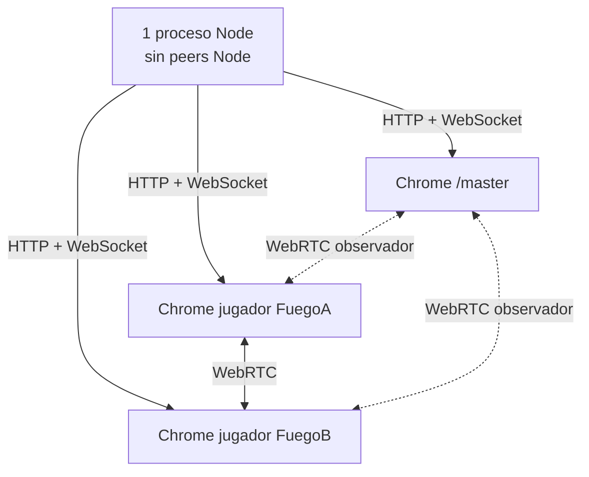

# 09 · La prueba de fuego, paso a paso

La prueba de fuego responde una pregunta observable:

> Si desaparece el único proceso Node durante una partida Clásica, ¿los navegadores ya conectados
> pueden acordar un líder, seguir descontando tiempo, procesar una respuesta y abrir otra ronda?

La prueba automatizada está en
[`test/selenium/P2PFireTest.java`](../../test/selenium/P2PFireTest.java) y se ejecuta con:

```bash
npm run test:p2p-fire
```

## Topología que crea la prueba



No hay un segundo proceso Node oculto. `PEERS` está vacío y el servidor único usa un puerto libre.

## Fase A: preparación

1. Compila TypeScript mediante el script de npm.
2. Inicia `node dist/server.js` con una base SQLite temporal.
3. Abre tres navegadores headless: dos jugadores y una maestra.
4. Registra `FuegoA` y `FuegoB`.
5. Espera que cada jugador tenga al menos un DataChannel abierto hacia otro jugador.

**Propiedad demostrada:** existe una ruta directa independiente de Node antes del fallo.

## Fase B: partida y réplica

1. `/master` inicia modo Clásico.
2. Ambos jugadores votan la categoría Computadores.
3. La prueba espera que el snapshot de ambos indique `phase === 'playing'`.
4. Espera `offlineAssetsReady === true` en los dos.
5. Exige que ambos caches contengan por lo menos una data URL.

**Propiedades demostradas:** la partida está realmente activa, cada navegador tiene estado y los
recursos externos ya no dependen exclusivamente del HTTP futuro.

## Fase C: desaparición de la laptop lógica

La prueba cierra primero el navegador `/master`, que representa la pantalla de la laptop. Verifica
otra vez que el canal jugador-jugador sigue abierto.

Después guarda:

- índice de ronda actual;
- tiempo restante antes del fallo.

Finalmente ejecuta:

```java
server.destroyForcibly();
```

y comprueba que el proceso terminó. No pausa Node ni simula un mensaje: mata el único servidor.

## Fase D: elección y continuidad

En ambos jugadores espera:

```text
failoverActive === true
```

Luego lee `leaderId` en los dos y exige:

- que no sea `null`;
- que sea exactamente el mismo.

Después espera que `timeLeft` sea menor que el valor anterior.

**Propiedades demostradas:** el detector activó failover, hubo acuerdo de líder y un timer ejecutado
fuera de Node siguió avanzando.

## Fase E: una acción real

La prueba obtiene la palabra desde el snapshot de `FuegoA` y la escribe en el campo de respuesta.
Esto no evalúa secreto o antitrampa; evalúa el protocolo de continuidad.

Espera que `round.solvers.length >= 1` en **ambos** navegadores.

**Propiedades demostradas:** la acción llegó al líder por DataChannel, fue validada y la nueva copia
se propagó al otro peer.

## Fase F: siguiente ronda con Node muerto

La prueba espera hasta 50 segundos a que `currentRoundIndex` sea mayor que antes. Después exige:

- `server.isAlive()` sigue siendo falso;
- el tiempo de la nueva ronda es mayor que cero.

Esta es la aserción más fuerte. Demuestra que no se limitó a terminar una animación ya programada:
el líder consumió la cola replicada, construyó otra ronda y arrancó un nuevo reloj.

## Matriz requisito–evidencia

| Requisito | Evidencia automática |
|---|---|
| Malla entre jugadores | `p2pOpenPlayerPeers >= 1` en ambos. |
| Recursos disponibles | `offlineAssetsReady` y data URLs en ambos caches. |
| Servidor realmente muerto | proceso terminado y luego `!server.isAlive()`. |
| Elección convergente | `leaderA != null` y `leaderA == leaderB`. |
| Reloj continuo | `p2pTime < timeBefore`. |
| Acción sin servidor | acierto aparece en `solvers` de ambos. |
| Estado convergente | ambos observan el acierto. |
| Nueva ronda offline | índice aumenta con Node todavía muerto. |

## Cómo hacer la demostración manual

### Preparación

1. Conecta laptop y celulares a un router/AP independiente.
2. Ejecuta el host y abre `/master` y `/join` usando la IP LAN de la laptop.
3. Usa entre dos y cinco jugadores.
4. Inicia Clásico.
5. Espera en **cada jugador** estos avisos:
   - “Respaldo P2P listo entre jugadores”.
   - “Partida offline lista…”.

### Caída

6. Apaga Node o desconecta la laptop del Wi-Fi. No apagues el router.
7. No recargues las pestañas de los jugadores.
8. Espera el banner que indica quién coordina y quién sigue a otro jugador.

### Evidencia visible

9. Comprueba que el reloj disminuye.
10. Envía una respuesta desde un seguidor.
11. Observa el acierto en todos los jugadores.
12. Espera que termine la ronda y aparezca la siguiente silueta.

## Qué no debe hacerse durante la prueba

- No usar el hotspot de la laptop que se va a apagar.
- No empezar antes de que la malla y los recursos estén listos.
- No recargar ni cerrar todos los navegadores.
- No probar Relajo o SiluStack como si tuvieran la misma garantía.
- No desconectar cada celular del router; se necesita una red entre sobrevivientes.
- No presentar el clúster Node opcional como requisito de esta prueba.

## Diagnóstico si falla

| Síntoma | Causa probable | Revisión |
|---|---|---|
| No aparece “Respaldo P2P listo” | DataChannels incompletos | AP isolation, firewall, misma LAN. |
| No aparece “Partida offline lista” | Snapshot sin rondas o recurso no descargado | HTTP de imágenes, rutas, consola. |
| Todos quedan reconectando | No hubo mayoría o no quedó canal jugador-jugador | Heartbeats y `openPeerIds()`. |
| Hay líder pero no baja el reloj | Snapshot ausente, fase no reanudable o modo no Clásico | `state`, `state.phase`, `state.mode`. |
| Siguiente ronda no muestra imagen | Recurso no estaba en `assetCache` | `offlineAssetsReady`, rutas `image/reveal`. |
| Recargar rompe todo | Comportamiento esperado sin host | La réplica actual es en memoria. |

## Inspección desde consola

Durante una práctica se puede observar:

```javascript
window.__silunetP2P.openPeerIds()
window.__silunetP2P.offlineAssetsReady
window.__silunetP2P.failoverActive
window.__silunetP2P.leaderId
window.__silunetP2P.state
```

Son herramientas de diagnóstico, no el criterio único de aprobación; la conducta visible y la
prueba automatizada aportan la evidencia completa.

Anterior: [08 · Recursos offline](08-recursos-offline.md). Siguiente:
[10 · Límites y defensa](10-limites-y-defensa.md).
