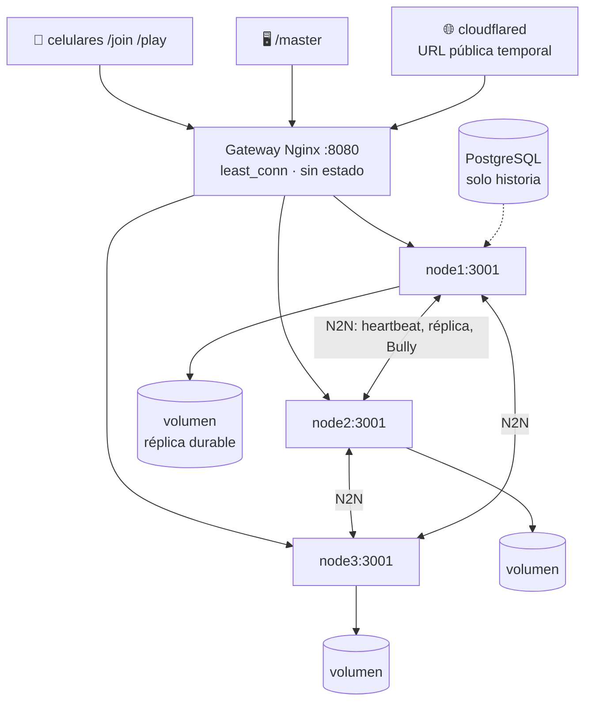

# 13 · Una sola dirección: gateway Nginx y despliegue en Docker

## El problema que resuelve

Hasta el capítulo 12 el navegador recibía una **lista de direcciones**: el servidor inyectaba
`window.SILUNET_NODES` en `/play` y `/master` a partir de `PUBLIC_NODES`. Si el backend
asignado moría, el cliente rotaba solo a `http://192.168.1.12:3001`, luego a `.13`, hasta
encontrar uno vivo.

Eso funciona cuando cada nodo tiene una IP alcanzable desde el celular. Deja de funcionar en
dos escenarios que sí queremos poder demostrar:

1. **Todo el clúster en una laptop con Docker.** Los nodos se llaman `node1:3001`,
   `node2:3001`, `node3:3001` *dentro* de la red del contenedor. Ese nombre no existe para
   el celular; publicar `3001`, `3002` y `3003` en la LAN obliga a repartir tres URLs.
2. **Enlace público por túnel.** El túnel expone **una** URL
   (`https://algo.trycloudflare.com`). No hay forma de rotar a "el segundo nodo" porque desde
   fuera solo existe una puerta.

## La solución: el punto de entrada deja de ser un nodo

Se antepone un **gateway Nginx** ([`docker/nginx.conf`](../../docker/nginx.conf)) que escucha
en `8080` y reparte hacia los tres backends.



### `PUBLIC_NODES=origin`

Es la pieza de código que activa el modo gateway. En
[`src/server.ts`](../../src/server.ts):

```ts
const SAME_ORIGIN_GATEWAY = PUBLIC_NODES_SETTING.toLowerCase() === 'origin';

function siblingNodeUrls(): string[] {
  if (SAME_ORIGIN_GATEWAY) return [];   // no inyecta lista de hermanos
  ...
}
```

Con la lista vacía, `buildNodeList()` en `play.html` queda con **un solo destino: su propio
origen**. La reconexión ya no consiste en "probar otra IP", sino en **volver a abrir el
WebSocket contra la misma URL**; es Nginx quien elige un backend vivo en ese momento.

| Modo | `PUBLIC_NODES` | Qué hace el navegador al caerse su backend |
|---|---|---|
| LAN con tres IP | `http://192.168.1.11:3001,...12,...13` | Reintenta 2 veces, luego rota a la siguiente IP de la lista. |
| Detrás del gateway | `origin` | Reintenta contra su mismo origen; el gateway lo reasigna. |

Ambos modos son el **Eje 4 visto desde el cliente**: continuidad sin recargar la página y sin
perder el puntaje, porque el token del jugador lo reidentifica en el nodo nuevo.

### Qué hace y qué NO hace el gateway

```nginx
upstream silunet_nodes {
  least_conn;
  server node1:3001 max_fails=1 fail_timeout=3s;
  server node2:3001 max_fails=1 fail_timeout=3s;
  server node3:3001 max_fails=1 fail_timeout=3s;
}
```

- `least_conn` reparte por número de conexiones abiertas, no por peticiones: es el criterio
  correcto cuando cada cliente mantiene **un WebSocket permanente**.
- `max_fails=1 fail_timeout=3s` saca de rotación al nodo muerto tras el primer fallo.
- `proxy_next_upstream error timeout http_502 http_503 http_504` reintenta el *handshake*
  contra otro nodo si el primero ya no contesta. Una conexión WebSocket ya establecida no se
  "migra": se corta y el cliente vuelve a pedir una, que ya cae en un nodo sano.
- El bloque `map $http_upgrade` es lo que permite el *upgrade* a WebSocket a través del proxy.
- `map $http_x_forwarded_proto` conserva el esquema original, para que detrás del túnel el
  servidor construya `https://` y `wss://` y no `http://`.

**El gateway no es el coordinador.** No conoce el término, no participa en Bully, no sabe
quién es líder. Puede perfectamente mandar a un jugador a un **seguidor**; ese seguidor
reenvía la acción al líder por `N_FORWARD_*` y la respuesta vuelve enrutada con `N_SEND_TO`
(capítulo 12). La detección de fallos sigue siendo asunto de los nodos entre sí: heartbeats,
quorum y elección.

**Limitación honesta que hay que decir en la defensa:** un único Nginx es un punto único de
entrada. No compromete la consistencia —el estado sigue replicado 2/3 y el líder se elige
entre nodos— pero si el gateway muere, nadie entra hasta que vuelva. Es una comodidad de
demostración; el despliegue **físicamente** distribuido (opción B: un nodo Docker por laptop
con las tres IP en `PUBLIC_NODES`) no lo usa y ahí la rotación vive en el cliente.

## La topología en Docker

[`compose.cluster.yaml`](../../compose.cluster.yaml) levanta cinco servicios:

| Servicio | Rol | Detalle |
|---|---|---|
| `postgres` | historia cerrada | volumen propio; `pg_isready` como healthcheck. |
| `node1/2/3` | backends simétricos | misma imagen `silunet:local`, solo cambian `NODE_ID` y `PEERS`. |
| `gateway` | Nginx | arranca cuando los tres nodos están `healthy`. |
| `tunnel` | `cloudflared` | perfil opcional `tunnel`; publica **solo** el gateway. |

Dos detalles que importan para el eje distribuido:

1. **Un volumen por nodo** (`silunet_node1_data`…). La réplica durable de cada backend vive
   en `/app/data/replicas` **dentro de su volumen**. Por eso `docker-cluster.ps1 down` usa
   `down` y nunca `down -v`: borrar los volúmenes equivale a que los tres nodos pierdan la
   memoria a la vez, que es justamente el escenario que el diseño no pretende cubrir.
2. **El healthcheck consulta `/api/info`**, el mismo endpoint que reporta `coordinator`,
   `clusterTerm`, `quorumAvailable` y `replicaIndex`. Un contenedor "healthy" es un nodo que
   además está respondiendo su estado de clúster.

## Prueba de fuego con un solo comando

```powershell
.\scripts\docker-cluster.ps1 fire
```

El script no elige un nodo al azar: pregunta a `/api/info` **quién coordina ahora** y mata a
ese. Usa `docker compose kill` y no `stop` — `stop` manda `SIGTERM` y espera un cierre
ordenado, que es lo contrario de una caída. Después consulta el gateway cada 400 ms hasta que
aparezca un `coordinator` distinto **con `quorumAvailable: true`**, e imprime cuántos
milisegundos tomó.

Lo que demuestra frente al público: la URL del túnel **no cambia**, los celulares se
reconectan solos contra la misma dirección y la partida sigue.

```powershell
.\scripts\docker-cluster.ps1 recover
```

Reintegra el nodo caído, que arranca leyendo su réplica de disco. **No se mata un segundo
nodo antes de `recover`**: con uno solo de tres no hay mayoría y el clúster se detiene a
propósito (capítulo 12).

## Dos ajustes que el entorno Docker obligó a hacer

### `HEARTBEAT_TIMEOUT_MS`: de 2000 a 5000 ms

Docker Desktop puede **pausar brevemente un contenedor** mientras se resuelve un `fsync`. Con
umbral de 2 s eso disparaba elecciones falsas: el nodo estaba vivo, solo congelado un
instante, y los otros dos ya lo daban por muerto y cambiaban de término.

Es el compromiso clásico del detector de fallos (capítulo 5) llevado a números concretos:
subir el umbral **reduce falsos positivos** y **aumenta el tiempo de detección**. Con latido
cada segundo, 5 s siguen siendo cinco latidos perdidos consecutivos: no oculta una caída
real, solo deja de castigar una pausa de disco.

### `Cache-Control` explícito en el servidor estático

```ts
const cacheControl = ext === '.html'
  ? 'no-store'
  : ext === '.js' ? 'no-cache' : 'public, max-age=3600';
```

No es una optimización, es corrección distribuida. Un `play.html` cacheado por el navegador
del celular es **un cliente de una versión anterior del protocolo**: manda `stateVersion` con
otra semántica o pierde campos que el servidor ahora exige (capítulo 14). Detrás del gateway
y del túnel hay más capas que pueden cachear, así que el HTML se marca `no-store`, el JS
`no-cache` (revalida siempre) y las imágenes/fuentes sí se cachean una hora.

Como refuerzo, `/join` redirige a `/play?v=<fecha>-<etiqueta>`; el parámetro no lo lee nadie,
existe solo para que una caché intermedia terca vea una URL distinta.

## Código para contrastar

- [`docker/nginx.conf`](../../docker/nginx.conf): balanceo, WebSocket upgrade y esquema.
- [`compose.cluster.yaml`](../../compose.cluster.yaml): los cinco servicios y sus volúmenes.
- [`scripts/docker-cluster.ps1`](../../scripts/docker-cluster.ps1): `up`, `tunnel`, `fire`,
  `recover`.
- [`src/server.ts`](../../src/server.ts): `SAME_ORIGIN_GATEWAY`, `siblingNodeUrls()`,
  cabeceras de caché.
- [`docs/DESPLIEGUE-DOCKER.md`](../DESPLIEGUE-DOCKER.md): el procedimiento operativo completo.

Anterior: [12 · Réplicas backend durables](12-replicas-backend-durables.md). Siguiente:
[14 · Cerco de acciones](14-cerco-de-acciones.md).
