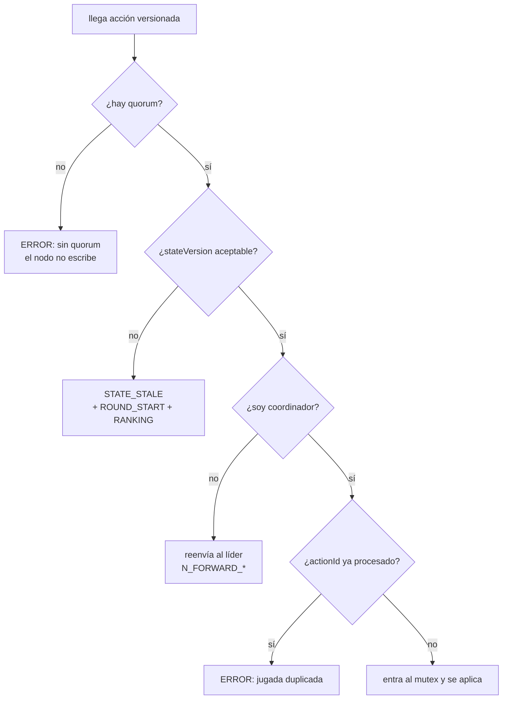

# 14 · Cerco de acciones: `stateVersion`, `actionId` y quién deduplica

El capítulo 12 explicó cómo se **confirma** un estado (término, índice, mayoría 2/3). Este
explica la otra mitad: cómo se decide si una acción que llega de un celular **merece** ser
aplicada sobre ese estado. Son las dos garantías clásicas de un sistema replicado:

- **a lo sumo una vez** — un acierto no puede contarse dos veces aunque el mensaje se
  duplique o el líder cambie a mitad de camino;
- **nada sobre una vista vieja** — un voto emitido mirando una pantalla de hace diez segundos
  no debe modificar una ronda que ya terminó.

## Qué viaja con cada acción

Solo un conjunto acotado de mensajes está sujeto al cerco, el que puede modificar el estado
autoritativo:

```ts
const VERSIONED_ACTIONS = new Set<string>([
  'GUESS', 'REQUEST_HINT', 'START_GAME', 'END_GAME', 'STACK_ACTION', 'CAST_VOTE',
]);
```

El cliente ([`public/play.html`](../../public/play.html)) los enriquece antes de enviarlos:

```js
msg = Object.assign({}, msg, {
  stateVersion,                                              // última versión que vio
  actionId: `${myPlayerId || 'pending'}-${Date.now()}-${++actionSequence}`,
  lamport: msg.lamport ?? lTick(),
});
```

- **`stateVersion`** — el `index` de réplica más alto que este navegador ha visto. Se
  actualiza con *cualquier* mensaje del servidor, porque `send()` en el backend estampa
  `stateVersion` y `lamport` en todo lo que sale:
  `stateVersion = Math.max(stateVersion, msg.stateVersion)`.
- **`actionId`** — identificador único de *este intento concreto*. Es el que permite reenviar
  sin miedo.
- **`lamport`** — el reloj lógico del Eje 2, que sigue decidiendo el **orden** (quién fue
  primero); el cerco decide la **admisión**.

> Detalle real que costó un fallo: el `actionId` se construía con una variable `playerId` que
> en `play.html` no existe —la buena es `myPlayerId`—, así que **todas** las acciones se
> etiquetaban `pending-…`. Seguían siendo únicas por el timestamp y el contador, pero perdían
> la trazabilidad por jugador. Corregido en la versión actual.

## La validación en el nodo que recibe

[`src/server.ts`](../../src/server.ts), `validateClientState()`, en este orden:



### 1. Primero el quorum

Si el nodo no tiene mayoría no valida nada más: responde con error. Un nodo aislado **no
acepta jugadas**, aunque su copia en memoria parezca perfectamente jugable. Es la regla de
consistencia estricta del capítulo 12 aplicada en la puerta de entrada.

### 2. La ventana de versión

```ts
const MAX_ACTION_VERSION_LAG = 8;

function actionVersionIsAcceptable(received: number | null, expected: number): boolean {
  return received == null
    || (Number.isSafeInteger(received) && received <= expected
        && expected - received <= MAX_ACTION_VERSION_LAG);
}
```

La versión original exigía **igualdad exacta** (`received === expected`) y era demasiado
estricta en la práctica. El índice de réplica avanza con *cada* commit: cada tick de reloj
que cambia estado, cada voto de otro jugador, cada letra revelada. Entre el último mensaje que
alcanzó a pintar el celular y el momento en que la persona toca "votar", el líder puede haber
confirmado varios índices más —y a través del gateway o del túnel, unos cuantos más todavía—.
Con igualdad exacta se rechazaban votos y respuestas **legítimos** por una carrera de red
normal.

La ventana conserva las dos condiciones que sí importan:

| Caso | `received` vs `expected` | Resultado | Por qué |
|---|---|---|---|
| Cliente al día o con retraso normal | `expected - received ≤ 8` | se acepta | latencia de red, no vista obsoleta. |
| Cliente muy atrasado | `expected - received > 8` | `STATE_STALE` | está mirando otra ronda. |
| Versión del futuro | `received > expected` | `STATE_STALE` | este nodo aún no confirmó ese índice: o va detrás, o el mensaje está manipulado. |
| Cliente antiguo sin campo | `received == null` | se acepta | compatibilidad con bots y clientes de prueba. |

Y `STATE_STALE` **no es solo un rechazo**: el servidor acompaña la respuesta con
`ROUND_START` y `RANKING` vigentes. El cliente se resincroniza sin recargar y el jugador solo
ve un aviso de "el tablero cambió".

### 3. La deduplicación, solo en el coordinador

```ts
if (versionMatches && (!cluster.isCoordinator || game.acceptAction(msg.actionId))) return true;
```

Ese `!cluster.isCoordinator ||` es la corrección más sutil de esta etapa. Antes, **todos** los
nodos llamaban a `acceptAction()`. El resultado era una acción legítima perdida:

1. Ana está conectada a `node3`, que es **seguidor**.
2. `node3` consume el `actionId` en su propia copia del juego y lo marca como procesado.
3. `node3` reenvía la acción al líder con `N_FORWARD_GUESS`.
4. El líder valida `validateForwardedAction()` → llama a `acceptAction()`… con el mismo id.
5. En **la copia del líder** ese id está libre, se aplica bien; pero cuando el líder replica
   el snapshot, el seguidor recibe un estado donde ese id ya figuraba. Cualquier reenvío
   legítimo posterior (reconexión, reintento) quedaba silenciosamente descartado por el
   seguidor antes de llegar al líder.

La regla actual reparte responsabilidades limpiamente:

| Nodo | Qué valida | Qué no hace |
|---|---|---|
| Seguidor | quorum y ventana de versión | no consume `actionId`; solo reenvía. |
| Coordinador | quorum, ventana **y** `actionId` | es el único punto donde se decide "esto ya pasó". |

Un único árbitro de idempotencia, que además es el único que escribe. El camino reenviado usa
exactamente el mismo criterio en `validateForwardedAction()`, y devuelve el error al celular
correcto con `N_SEND_TO` (respuesta enrutada a la conexión exacta, no un broadcast).

## Por qué la deduplicación sobrevive al failover

`acceptAction()` guarda los ids en `processedActionIds`, una ventana de **1000 acciones**:

```ts
private static readonly ACTION_ID_WINDOW = 1000;
```

Lo importante es que ese conjunto **forma parte del snapshot**. Se replica con
`N_REPLICATE`, se escribe a disco con `fsync` y se restaura en `Game.restore()`. Es decir:

> Si el líder cae justo después de aplicar un acierto pero antes de que el celular reciba la
> confirmación, el celular reintenta contra el líder nuevo — y el líder nuevo **ya sabe** que
> ese `actionId` fue aplicado, porque lo leyó del disco junto con el marcador.

Sin esa propiedad, el reintento del cliente sumaría los puntos dos veces. Esa es la diferencia
entre "reintentar es peligroso" y "reintentar es gratis", y es lo que permite que la
reconexión automática del capítulo 13 sea agresiva sin corromper el marcador.

## Escrituras durables sin bloquear el clúster

Un cambio relacionado en [`src/replicaStore.ts`](../../src/replicaStore.ts): `commit()` era
síncrono (`fs.writeFileSync` + `fs.fsyncSync`) y ahora devuelve una promesa, con las
escrituras serializadas en una cola FIFO de promesas:

```ts
const pending = this.commitQueue.then(work, work);
this.commitQueue = pending.then(() => undefined, () => undefined);
```

Dos motivos, ambos distribuidos:

1. **Un `fsync` síncrono congela el event loop de Node.** Mientras el disco confirma, ese
   proceso no manda heartbeats, no responde `N_ALIVE` y no atiende WebSockets. Con réplicas
   llegando seguidas, un nodo perfectamente sano parecía muerto y disparaba elecciones.
2. **La cola conserva el orden.** Asincronía sin cola permitiría que el índice 12 se escribiera
   después del 13 y dejara en disco una réplica retrocedida. Encadenar las promesas garantiza
   una única escritura en vuelo y el mismo orden con que se aceptaron los commits.

El cercado por término e índice se mantiene *dentro* de la tarea encolada, así que un líder
cercado sigue sin poder pisar la réplica vigente. `REPLICA_COMMIT_TIMEOUT_MS` subió a 4000 ms
por coherencia con el umbral de heartbeat del capítulo 13: si el disco de un seguidor tarda,
lo correcto es esperar el ACK, no declarar el estado no confirmado y suspender la partida.

## Qué falla si algo de esto se quita

| Si se quita | Síntoma observable |
|---|---|
| `stateVersion` | un voto tardío reabre o altera una ronda ya cerrada. |
| la ventana de tolerancia | jugadores con Wi-Fi normal ven "el tablero cambió" en cada intento. |
| `actionId` | una reconexión durante un failover suma los puntos del acierto dos veces. |
| `processedActionIds` en el snapshot | la deduplicación se pierde exactamente cuando más se necesita: al cambiar de líder. |
| la exclusividad del coordinador | acciones legítimas descartadas por un seguidor antes de llegar al líder. |
| la cola de commits | elecciones falsas por bloqueo de disco, o réplicas escritas fuera de orden. |

## Código para contrastar

- [`src/server.ts`](../../src/server.ts): `VERSIONED_ACTIONS`, `actionVersionIsAcceptable`,
  `validateClientState`, `validateForwardedAction`, `commitSnapshot`.
- [`src/game.ts`](../../src/game.ts): `acceptAction`, `ACTION_ID_WINDOW`, `restore`.
- [`src/replicaStore.ts`](../../src/replicaStore.ts): la cola de commits durables.
- [`public/play.html`](../../public/play.html): enriquecimiento de acciones y manejo de
  `STATE_STALE`.
- [`test/unit/SilunetTest.ts`](../../test/unit/SilunetTest.ts): la prueba de réplica durable,
  ahora `async`, que verifica el cercado por término.

Anterior: [13 · Gateway y una sola dirección](13-gateway-y-una-sola-direccion.md). Vuelta al
[índice](README.md).
