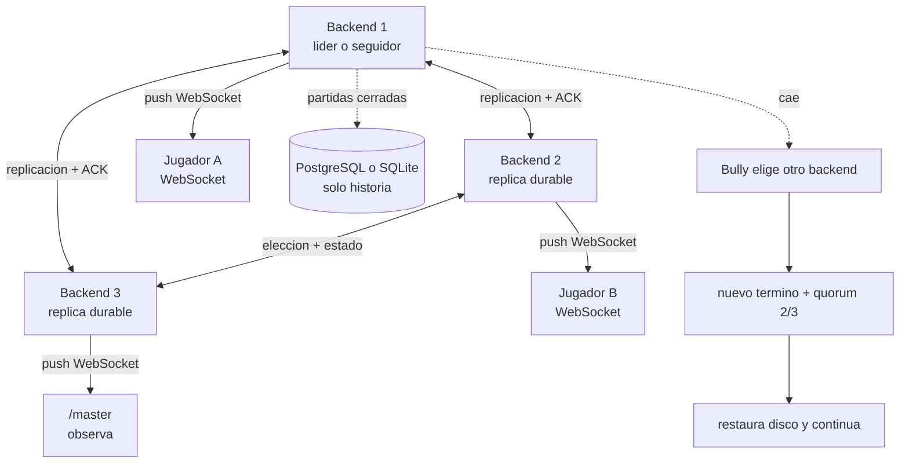

# Conceptos de Silunet: ruta de aprendizaje

Esta carpeta explica Silunet desde los fundamentos hasta la prueba de fuego. No presupone
conocimientos avanzados de sistemas distribuidos. La idea es que cada documento responda
una pregunta concreta y prepare el siguiente.

El foco actual es el clúster de **tres backends simétricos**. Los tres modos comparten el
mismo mecanismo de réplica durable y failover; los navegadores nunca toman autoridad.

## La idea central en una frase

Un backend líder ordena y serializa acciones; dos seguidores escriben réplicas durables.
Solo un estado confirmado por mayoría 2/3 se empuja por WebSocket. Si cae el líder, otro
backend recupera la partida desde disco y continúa.

## Orden recomendado

| Paso | Documento | Pregunta que responde |
|---:|---|---|
| 1 | [Panorama y vocabulario](01-panorama-y-vocabulario.md) | ¿Qué componentes existen y cómo se llaman? |
| 2 | [Red y transportes](02-red-y-transportes.md) | ¿Para qué se usan HTTP y WebSocket? |
| 3 | [Estado autoritativo y snapshots](03-estado-autoritativo-y-snapshots.md) | ¿Qué debe copiarse para continuar una partida? |
| 4 | [Malla P2P y réplicas calientes](04-malla-p2p-y-replicas.md) | ¿Cómo quedan conectados los jugadores? |
| 5 | [Detección de fallos](05-deteccion-de-fallos.md) | ¿Cómo se sospecha que el host murió? |
| 6 | [Elección de líder y consistencia](06-eleccion-y-consistencia.md) | ¿Cómo evitan que todos coordinen a la vez? |
| 7 | [Motor Clásico sin host](07-motor-clasico-sin-host.md) | ¿Qué ejecuta el nuevo líder? |
| 8 | [Siluetas y recursos offline](08-recursos-offline.md) | ¿Por qué las imágenes siguen apareciendo? |
| 9 | [Prueba de fuego paso a paso](09-prueba-de-fuego.md) | ¿Qué se mata, qué continúa y qué verifica la prueba? |
| 10 | [Límites, decisiones y defensa](10-limites-y-defensa.md) | ¿Qué garantiza realmente el proyecto y cómo explicarlo? |
| 11 | [Monitoreo distribuido por participante](11-monitoreo-distribuido.md) | ¿Cómo ve el master los latidos, latencia, peers y nodos de cada persona? |
| 12 | [Réplicas backend durables](12-replicas-backend-durables.md) | ¿Cómo continúa todo el backend con quorum, término y recuperación desde disco? |

> Los capítulos 1 a 10 conservan la evolución histórica del prototipo. Para la arquitectura
> autoritativa actual, empieza por el capítulo 12; el 11 explica su observabilidad.

## Mapa mental mínimo

## Cuatro reglas que evitan confusiones

1. **Los tres servidores son réplicas.** Cualquiera puede ser elegido líder; un navegador
   conectado por `/play` nunca se convierte en servidor.
2. **La base de datos no mantiene viva la ronda.** Guarda perfiles e historia cerrada; no
   participa en ticks, respuestas, puntajes ni elección del coordinador.
3. **La pantalla `/master` tampoco es líder.** Observa y controla la partida, pero la autoridad
   reside en el backend elegido por quorum.
4. **La continuidad usa disco en cada backend.** Tolera la caída de un nodo y el reinicio de
   procesos; con solo 1 de 3 no acepta escrituras para evitar dos verdades distintas.

## Código autoritativo para contrastar la explicación

- [src/monitoring.ts](../../src/monitoring.ts): agregación de telemetría de personas y nodos.
- [public/distributed-monitor.js](../../public/distributed-monitor.js): panel operativo de /master.
- [`src/cluster.ts`](../../src/cluster.ts): heartbeats, quorum, términos y elección Bully.
- [`src/replicaStore.ts`](../../src/replicaStore.ts): snapshot durable y cercado por término/índice.
- [`src/server.ts`](../../src/server.ts): WebSocket, commits por mayoría y cambio de líder.
- [`src/game.ts`](../../src/game.ts): reglas del motor original y construcción del snapshot.
- [`src/types.ts`](../../src/types.ts): forma de los estados y mensajes.
- [`vv/caos-coordinador.js`](../../vv/caos-coordinador.js): prueba de fuego automatizada.

Siguiente: [01 · Panorama y vocabulario](01-panorama-y-vocabulario.md).
