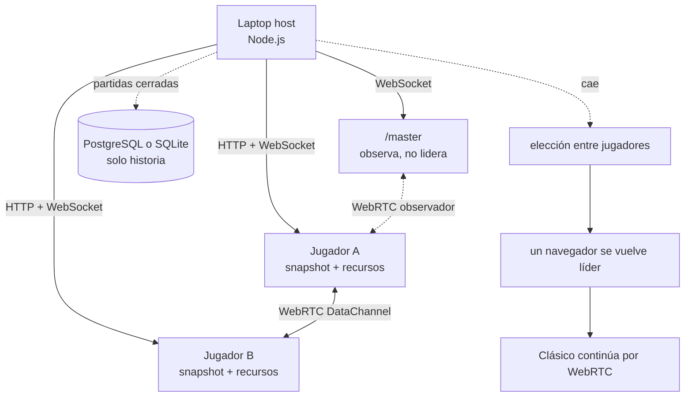

# Conceptos de Silunet: ruta de aprendizaje

Esta carpeta explica Silunet desde los fundamentos hasta la prueba de fuego. No presupone
conocimientos avanzados de sistemas distribuidos. La idea es que cada documento responda
una pregunta concreta y prepare el siguiente.

El foco es el modo **Clásico**, porque es el modo que puede continuar cuando desaparece la
única laptop que ejecuta Node.js. Relajo y SiluStack no forman parte de esa garantía.

## La idea central en una frase

Mientras la laptop está viva, Node.js es el motor autoritativo y usa WebSocket; al mismo
tiempo entrega réplicas completas a los navegadores y los conecta mediante WebRTC. Si la
laptop desaparece, los jugadores detectan la caída, eligen un líder y ese navegador retoma
el motor Clásico desde la última réplica, sin hacer nuevas llamadas HTTP.

## Orden recomendado

| Paso | Documento | Pregunta que responde |
|---:|---|---|
| 1 | [Panorama y vocabulario](01-panorama-y-vocabulario.md) | ¿Qué componentes existen y cómo se llaman? |
| 2 | [Red y transportes](02-red-y-transportes.md) | ¿Para qué se usan HTTP, WebSocket y WebRTC? |
| 3 | [Estado autoritativo y snapshots](03-estado-autoritativo-y-snapshots.md) | ¿Qué debe copiarse para continuar una partida? |
| 4 | [Malla P2P y réplicas calientes](04-malla-p2p-y-replicas.md) | ¿Cómo quedan conectados los jugadores? |
| 5 | [Detección de fallos](05-deteccion-de-fallos.md) | ¿Cómo se sospecha que el host murió? |
| 6 | [Elección de líder y consistencia](06-eleccion-y-consistencia.md) | ¿Cómo evitan que todos coordinen a la vez? |
| 7 | [Motor Clásico sin host](07-motor-clasico-sin-host.md) | ¿Qué ejecuta el nuevo líder? |
| 8 | [Siluetas y recursos offline](08-recursos-offline.md) | ¿Por qué las imágenes siguen apareciendo? |
| 9 | [Prueba de fuego paso a paso](09-prueba-de-fuego.md) | ¿Qué se mata, qué continúa y qué verifica la prueba? |
| 10 | [Límites, decisiones y defensa](10-limites-y-defensa.md) | ¿Qué garantiza realmente el proyecto y cómo explicarlo? |

## Mapa mental mínimo

## Cuatro reglas que evitan confusiones

1. **P2P no significa que nunca exista servidor.** El servidor es necesario para cargar la
   aplicación, registrar jugadores, iniciar la partida, entregar snapshots y señalizar WebRTC.
2. **La base de datos no mantiene viva la ronda.** Guarda perfiles e historia cerrada; no
   participa en ticks, respuestas, puntajes o elección P2P.
3. **La pantalla `/master` no puede ser líder.** Observa el juego, pero solo los jugadores
   tienen identidad y acciones válidas para coordinar la continuidad.
4. **La continuidad usa memoria de los navegadores.** Sobrevive a la caída del host, pero no
   a cerrar o recargar todas las pestañas. Es una réplica caliente distribuida, no almacenamiento
   durable en los celulares.

## Código autoritativo para contrastar la explicación

- [`public/p2p.js`](../../public/p2p.js): malla, heartbeats, mayoría, elección y motor offline.
- [`src/server.ts`](../../src/server.ts): servidor HTTP/WebSocket, señalización y snapshots.
- [`src/game.ts`](../../src/game.ts): reglas del motor original y construcción del snapshot.
- [`src/types.ts`](../../src/types.ts): forma de los estados y mensajes.
- [`test/selenium/P2PFireTest.java`](../../test/selenium/P2PFireTest.java): prueba automatizada.

Siguiente: [01 · Panorama y vocabulario](01-panorama-y-vocabulario.md).
